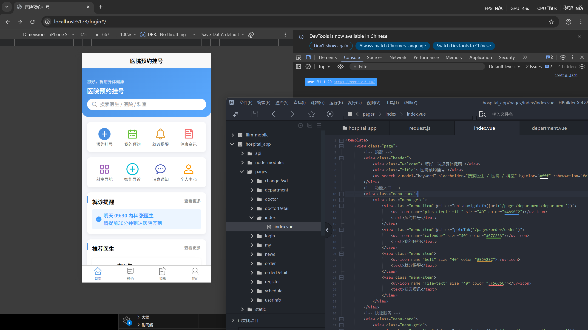
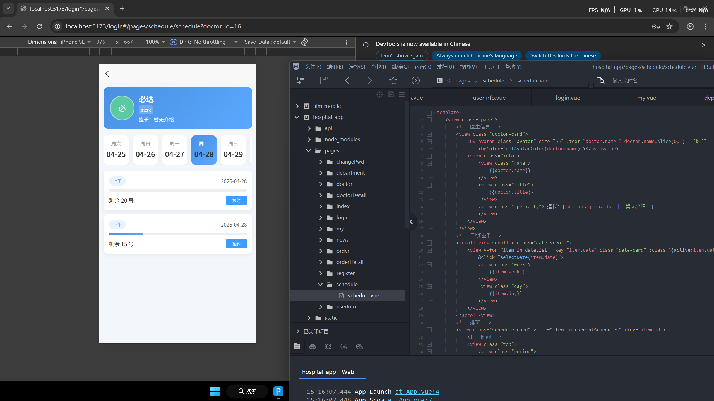
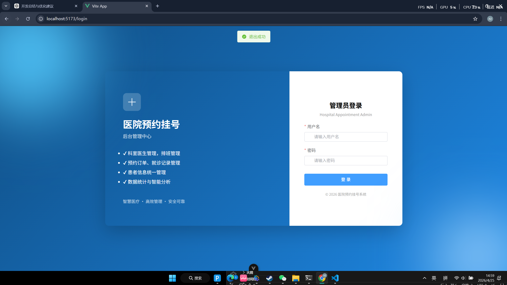
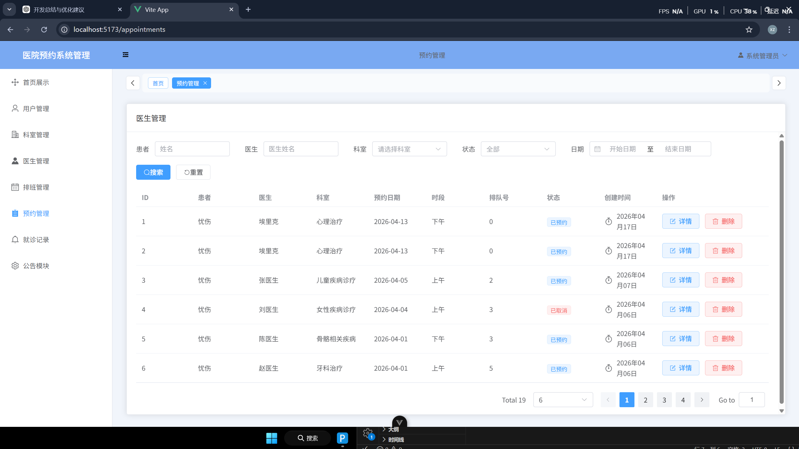

<div align="center">

# 🏥 Hospital Appointment System

### 基于 uni-app + Vue3 + Laravel 的前后端分离医院预约挂号系统

<p align="center">
  
  
  
  
  
</p>

<p align="center">
  一个完整的医院预约挂号系统，包含用户移动端、后台管理端、Laravel API 服务端。
</p>

</div>

---

# 📖 项目介绍

Hospital Appointment System 是一个基于前后端分离架构开发的医院预约管理系统。

项目包含：

- 📱 用户移动端（uni-app）
- 🖥 后台管理端（Vue3 + Element Plus）
- ⚙️ Laravel API 后端

系统主要实现：

- 用户预约挂号
- 医生管理
- 科室管理
- 排班管理
- 公告通知
- 后台数据管理

适用于：

- 毕业设计
- 校招项目
- Vue3 / uni-app 学习
- Laravel RESTful API 实践
- 前后端分离项目练习

---

# 🧩 项目架构

```text
hospital-appointment-system
│
├── hospital-admin      # Vue3 后台管理系统
├── hospital-app        # uni-app 用户移动端
├── hospital-api        # Laravel API 服务端
└── README-assets       # README 图片资源
```

---

# 🏗 系统架构图

```text
           ┌─────────────────┐
           │   uni-app App   │
           └────────┬────────┘
                    │ HTTP API
                    ▼
           ┌─────────────────┐
           │ Laravel API     │
           │ RESTful Server  │
           └────────┬────────┘
                    │
                    ▼
           ┌─────────────────┐
           │     MySQL       │
           └─────────────────┘
                    ▲
                    │
           ┌────────┴────────┐
           │ Vue3 Admin      │
           │ Management      │
           └─────────────────┘
```

---

# 🚀 技术栈

## 📱 用户端（hospital-app）

- uni-app
- Vue3
- uView UI
- Axios

---

## 🖥 后台管理端（hospital-admin）

- Vue3
- Vite
- Element Plus
- Pinia
- Vue Router
- Axios

---

## ⚙️ 服务端（hospital-api）

- Laravel
- MySQL
- RESTful API
- Eloquent ORM

---

# ✨ 功能模块

## 👤 用户端功能

- 用户登录 / 注册
- 首页轮播
- 科室列表
- 医生列表
- 医生详情
- 在线预约挂号
- 我的预约
- 消息通知
- 用户中心

---

## 🛠 后台管理功能

- 管理员登录
- 用户管理
- 医生管理
- 科室管理
- 排班管理
- 预约管理
- 公告管理
- 数据统计

---

## ⚙️ 后端接口功能

- RESTful API
- 登录认证
- 数据分页
- 文件上传
- 预约逻辑处理
- 数据关联查询

---

# 📸 项目截图

## 📱 用户端展示

### 首页



---

### 医生列表



---

### 我的预约


---

# 🖥 后台管理展示

### 后台登录页



---

### 数据管理


---

### 预约管理



---

# 📦 项目启动

## 1️⃣ 克隆项目

```bash
git clone https://github.com/你的GitHub用户名/hospital-appointment-system.git
```

---

# ⚙️ 启动后端（Laravel）

进入项目：

```bash
cd hospital-api
```

安装依赖：

```bash
composer install
```

复制配置：

```bash
cp .env.example .env
```

生成 key：

```bash
php artisan key:generate
```

配置数据库：

```env
DB_DATABASE=hospital_system
DB_USERNAME=root
DB_PASSWORD=你的密码
```

启动项目：

```bash
php artisan serve
```

---

# 🖥 启动后台管理（Vue3）

进入项目：

```bash
cd hospital-admin
```

安装依赖：

```bash
npm install
```

运行项目：

```bash
npm run dev
```

---

# 📱 启动 uni-app

使用：

- HBuilderX

打开：

```text
hospital-app
```

运行到：

- 微信小程序
- H5
- Android App

---

# 🗄 数据库说明

数据库名称：

```text
hospital_system
```

导入数据库文件：

```text
hospital_system.sql
```

---

# 🌟 项目亮点

✅ 前后端分离架构  
✅ uni-app 跨端开发  
✅ Vue3 + Composition API  
✅ Laravel RESTful API  
✅ 医院预约业务流程实现  
✅ 后台管理系统  
✅ GitHub 工程化管理  
✅ 模块化开发思想  

---

# 📚 后续优化方向

- JWT 权限认证
- Redis 缓存
- Docker 部署
- WebSocket 消息通知
- AI 导诊
- 数据可视化
- 在线支付
- 医生排班智能推荐

---

# 👨‍💻 作者

xz z

---

# ⭐ Star

如果这个项目对你有帮助，欢迎 Star ⭐
